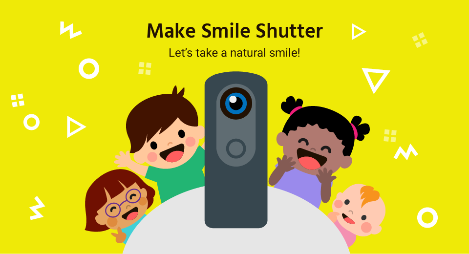

# Make Smile Shutter

[](https://pluginstore.theta360.com/plugins/jp.co.taosoftware.makesmileshutter.thetaplugin/)

Version: 1.0.0

## Contents

* [Terms of Service](#terms)
* [Maintainers](#maintainers)
* [Files included in the archive](#files)
* [Technical requirements for development](#requirements)
* [Using Libraries](#contents)
* [Getting Started](#started)
* [Where to find the latest information](#information)
* [Troubleshooting](#troubleshooting)
* [Trademark Information](#trademark)

<a name="terms"></a>
## Terms of Service

> You agree to comply with all applicable export and import laws and regulations applicable to the jurisdiction in which the Software was obtained and in which it is used. Without limiting the foregoing, in connection with use of the Software, you shall not export or re-export the Software  into any U.S. embargoed countries (currently including, but necessarily limited to, Crimea – Region of Ukraine, Cuba, Iran, North Korea, Sudan and Syria) or  to anyone on the U.S. Treasury Department’s list of Specially Designated Nationals or the U.S. Department of Commerce Denied Person’s List or Entity List.  By using the Software, you represent and warrant that you are not located in any such country or on any such list.  You also agree that you will not use the Software for any purposes prohibited by any applicable laws, including, without limitation, the development, design, manufacture or production of missiles, nuclear, chemical or biological weapons.

By using the Make Smile Shutter, you are agreeing to the above and the license terms, [LICENSE.txt](LICENSE.txt).

Copyright &copy; 2019 Taosoftware Co.,Ltd.

* Please use this plug-in after agreeing to this agreement.
* This plug-in produces a loud sound. Please give consideration to the surrounding people.
* We will not compensate for damages caused to users by using this plug-in at all
* This plug-in does not collect personal information.

<a name="maintainers"></a>
## Maintainers
* [Planner&Developer] [Chisato Karakama](https://github.com/baobab2013) at [Taosoftware](http://taosoftware.co.jp/en/android/)
* [Designer] [Miki Wada](https://lottiefiles.com/mwada) at [Taosoftware](http://taosoftware.co.jp/en/android/)
 
<a name="files"></a>
## Files included in the archive

```
├── README.md:            This file
├── LICENSE.txt:          Files concerning the contract
├── peerdevicelist:       Common Module for phoneapp and thetaplugin
├── phoneapp:             Phone App project
├── thetaplugin:          Theta Plugin project
├── build.gradle:         Android Studio build script
├── gradle:               Android Studio build script
├── gradle.properties:    Android Studio build script
├── gradlew:              Android Studio build script
├── gradlew.bat:          Android Studio build script
└── settings.gradle:      Android Studio build script
```

<a name="requirements"></a>
## Technical requirements for development

Make Smile Shutter was tested with a RICOH THETA V under the following conditions.

### Camera

#### Hardware

* RICOH THETA V

#### Firmware

* ver.2.50.1 and above

    > Information on checking and updating the firmware is [here](https://theta360.com/en/support/manual/v/content/pc/pc_09.html).

### Development Environment

Make Smile Shutter has been confirmed to operate under the following conditions.

#### Operating System

* Windows 10 Pro Version 1803(OS Build 17134.829)

#### Development environment

* Android&trade; Studio 3.3+
* gradle 3.3.1
* Android&trade; SDK (API Level 28)
* compileSdkVersion 28
* buildToolsVersion "27.0.3"
* minSdkVersion 23
* targetSdkVersion 28

<a name="contents"></a>
## Using Libraries


* Make Smile Shutter's "peerdevicelist" module uses following libraries

```
 implementation "org.jetbrains.kotlin:kotlin-stdlib-jdk7:1.3.21"
 implementation "androidx.constraintlayout:constraintlayout:2.0.0-beta1"
 implementation 'androidx.appcompat:appcompat:1.0.0'
 implementation 'androidx.lifecycle:lifecycle-extensions:2.0.0-rc01'
 implementation 'com.google.android.material:material:1.0.0-rc01'
 implementation "com.airbnb.android:lottie:3.0.0"
```

* Make Smile Shutter's "phoneapp" module uses following libraries

```
 implementation "org.jetbrains.kotlin:kotlin-stdlib-jdk7:1.3.21"
 implementation 'androidx.appcompat:appcompat:1.0.0'
 implementation 'com.google.android.material:material:1.0.0-rc01'
 implementation 'androidx.constraintlayout:constraintlayout:1.1.2'
 implementation 'androidx.lifecycle:lifecycle-extensions:2.0.0-rc01'
 implementation "com.airbnb.android:lottie:3.0.0"
 implementation 'com.google.android.gms:play-services-vision:17.0.2'
```

* Make Smile Shutter's "thetaplugin" module uses following libraries

```
 implementation "org.jetbrains.kotlin:kotlin-stdlib-jdk7:1.3.21"
 implementation 'com.android.support:appcompat-v7:28.0.0'
 implementation 'com.android.support:design:28.0.0'
 implementation 'com.android.support.constraint:constraint-layout:1.1.3'
 implementation 'androidx.lifecycle:lifecycle-extensions:2.0.0-rc01'
 implementation 'org.nanohttpd:nanohttpd-webserver:2.3.1'
 implementation 'com.samskivert:jmustache:1.14'
 implementation 'com.theta360:pluginlibrary:2.0.0'
```

<a name="started"></a>
## Getting Started

1. Open makesmileshutter as a project into Android&trade; Studio.
1. Please connect SMARTPHONE with USB.
1. Select "phoneapp" as a RUN TAEGET and build to install it into SMARTPHONE.
1. Please connect RICOH THETA V with USB.
1. Select "thetaplugin" as a RUN TAEGET and build to install it into RICOH THETA V.
1. By running them, installing and debuging is possible.
1. You can choose two ways to connect thetaplugin and phoneapp via WiFi Direct.
1. To use Vysor
    1. You can see the app screen of thetaplugin using [Vysor](https://www.vysor.io/).
    1. You can start scaning WiFi Direct enebled devices from Make Smile Shutter plug-in on Vysor and Make Smile Shutter on SMARTPHONE.
    1. You need to peer them from Make Smile Shutter Plug-in to show WiFi Direct Confirmation Dialog because Theta plug-in app is not allowed to show system's Dialog.
1. To use [RICOH THETA OFFICIAL APP](https://play.google.com/store/apps/details?id=com.theta360)
    1. You can see the app screen of thetaplugin using [Ricoh Theta Official App](https://play.google.com/store/apps/details?id=com.theta360)'s [WEB UI](https://api.ricoh/docs/theta-plugin/how-to-use/#using-a-web-server).
    1. You have to use [Wireless Router Connection](https://support.theta360.com/en/manual/v/content/prepare/prepare_08.html) to connect between RICOH THETA V and RICOH THETA OFFICIAL APP because Make Smile Shutter is using WiFi Direct which requires WiFi Turn ON.
    1. You can see the WEB UI of thetaplugin through RICOH THETA OFFICIAL APP.
    1. You need to peer them from Make Smile Shutter Plug-in's WEB UI to show WiFi Direct Confirmation Dialog because Theta plug-in app is not allowed to show system's Dialog.

<a name="information"></a>
## Where to find the latest information

* The latest information is published on [the WEB site](https://api.ricoh/docs/theta-plugin/).
* The latest SDK is released on [the GitHub project](https://github.com/ricohapi/theta-plugin-sdk).

<a name="troubleshooting"></a>
## Troubleshooting

If you have a request, create an issue on [the GitHub project](https://github.com/ricohapi/theta-plugin-sdk/issues).

<a name="trademark"></a>
## Trademark Information

The names of products and services described in this document are trademarks or registered trademarks of each company.

* Android, Nexus, Google Chrome, Google Play, Google Play logo, Google Maps, Google+, Gmail, Google Drive, Google Cloud Print and YouTube are trademarks of Google Inc.
* Apple, Apple logo, Macintosh, Mac, Mac OS, OS X, AppleTalk, Apple TV, App Store, AirPrint, Bonjour, iPhone, iPad, iPad mini, iPad Air, iPod, iPod mini, iPod classic, iPod touch, iWork, Safari, the App Store logo, the AirPrint logo, Retina and iPad Pro are trademarks of Apple Inc., registered in the United States and other countries. The App Store is a service mark of Apple Inc.
* Bluetooth Low Energy and Bluetooth are trademarks or registered trademarks of US Bluetooth SIG, INC., in the United States and other countries.
* Microsoft, Windows, Windows Vista, Windows Live, Windows Media, Windows Server System, Windows Server, Excel, PowerPoint, Photosynth, SQL Server, Internet Explorer, Azure, Active Directory, OneDrive, Outlook, Wingdings, Hyper-V, Visual Basic, Visual C ++, Surface, SharePoint Server, Microsoft Edge, Active Directory, BitLocker, .NET Framework and Skype are registered trademarks or trademarks of Microsoft Corporation in the United States and other countries. The name of Skype, the trademarks and logos associated with it, and the "S" logo are trademarks of Skype or its affiliates.
* Wi-Fi™, Wi-Fi Certified Miracast, Wi-Fi Certified logo, Wi-Fi Direct, Wi-Fi Protected Setup, WPA, WPA 2 and Miracast are trademarks of the Wi-Fi Alliance.
* The official name of Windows is Microsoft Windows Operating System.
* All other trademarks belong to their respective owners.
